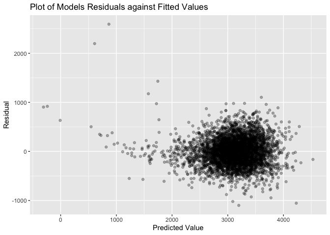
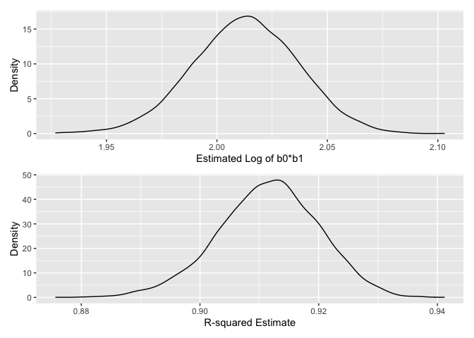

p8105\_hw6\_zv2138
================

# Question 1

## Load and Clean the Data

``` r
birthweight_df = 
  read_csv("./data/birthweight.csv") %>% 
  mutate(
    babysex = factor(babysex, levels = c('1', '2'), labels = c("male", "female")),
    malform = factor(malform, levels = c('0', '1'), labels = c("absent", "present")),
    frace = factor(frace, levels = c("1", "2", "3", "4", "8", "9"), labels = c("White", "Black", "Asian", "Puerto Rican", "Other", "Unknown")),
    mrace = factor(mrace, levels = c("1", "2", "3", "4", "8", "9"), labels = c("White", "Black", "Asian", "Puerto Rican", "Other", "Unknown")))
```

    ## Rows: 4342 Columns: 20

    ## ── Column specification ────────────────────────────────────────────────────────
    ## Delimiter: ","
    ## dbl (20): babysex, bhead, blength, bwt, delwt, fincome, frace, gaweeks, malf...

    ## 
    ## ℹ Use `spec()` to retrieve the full column specification for this data.
    ## ℹ Specify the column types or set `show_col_types = FALSE` to quiet this message.

``` r
# No Missing Values 
colSums(is.na(birthweight_df))
```

    ##  babysex    bhead  blength      bwt    delwt  fincome    frace  gaweeks 
    ##        0        0        0        0        0        0        0        0 
    ##  malform menarche  mheight   momage    mrace   parity  pnumlbw  pnumsga 
    ##        0        0        0        0        0        0        0        0 
    ##    ppbmi     ppwt   smoken   wtgain 
    ##        0        0        0        0

## My Regression Model

To model baby birthweight I included the following variables with
explanation as to what theories/why I choose to include them in my
model.

-   baby’s sex - on average male babyies typically are a little heavier
    than female babies
-   gestational age in weeks - in general higher gestational age
    corresponds to heavier babies
-   mother’s weight gain during pregnancy (pounds) - it would seem
    logical that mothers that gain more weight have heavier babies and
    placentas
-   baby’s length at birth (centimeters) - it is logical to think taller
    babies are on average heavier
-   baby’s head circumference at birth (centimeters) - it is logical to
    think bigger headed babies are on average larger babies so weigh
    more
-   presence of malformations that could affect weight - clearly this
    variable indicates it may affect the baby’s weight
-   mother’s age at delivery (years) - research shows older mothers
    usually is associated with birth weight

``` r
my_model = lm(bwt ~ babysex + gaweeks + wtgain + blength + bhead + malform + momage, data = birthweight_df) 
```

## Plotting My Model

``` r
birthweight_df %>% 
  modelr::add_predictions(my_model) %>% 
  modelr::add_residuals(my_model) %>% 
  ggplot(aes(x = pred, y = resid)) + 
  geom_point(alpha = .3) +
    labs(
    x = "Predicted Value",
    y = "Residual"
  )
```

<!-- -->

From the graph we see most residuals fall between -500 and 500. We see a
few outliers present in the data with abnormally large residuals.

## Model Comparison

``` r
cv_birthweight_df = 
  crossv_mc(birthweight_df, 50) 

cv_birthweight_df = 
  cv_birthweight_df %>% 
  mutate(
    train = map(train, as_tibble),
    test = map(test, as_tibble))

cv_birthweight_df =
  cv_birthweight_df %>% 
    mutate(
      my_model = map(train, ~lm(bwt ~ babysex + gaweeks + wtgain + blength + bhead + malform + momage, data = .x)),
      main_model = map(train, ~lm(bwt ~ blength + gaweeks, data = .x)),
      interaction_model = map(train, ~lm(bwt ~ bhead * babysex * blength, data = .x))
    ) %>% 
  mutate(
    rmse_my_model = map2_dbl(my_model, test, ~rmse(model = .x, data = .y)),
    rmse_main_effects = map2_dbl(main_model, test, ~rmse(model = .x, data = .y)),
    rmse_interaction = map2_dbl(interaction_model, test, ~rmse(model = .x, data = .y)))
```

``` r
cv_birthweight_df %>% 
  select(starts_with("rmse")) %>% 
  pivot_longer(
    everything(),
    names_to = "model",
    values_to = "rmse",
    names_prefix = "rmse_") %>% 
  mutate(model = fct_inorder(model)) %>% 
  ggplot(aes(x = model, y = rmse)) +
  geom_violin() + 
  labs(
    x = "Model",
    y = "RMSE"
  )
```

<!-- -->

By comparing the three models and their RMSE values we can see my model
is the best fit for the birthweight data set and the main effects model
provides the worst fit.

# Question 2

## Load the Data

``` r
weather_df = 
  rnoaa::meteo_pull_monitors(
    c("USW00094728"),
    var = c("PRCP", "TMIN", "TMAX"), 
    date_min = "2017-01-01",
    date_max = "2017-12-31") %>%
  mutate(
    name = recode(id, USW00094728 = "CentralPark_NY"),
    tmin = tmin / 10,
    tmax = tmax / 10) %>%
  select(name, id, everything())
```

    ## Registered S3 method overwritten by 'hoardr':
    ##   method           from
    ##   print.cache_info httr

    ## using cached file: ~/Library/Caches/R/noaa_ghcnd/USW00094728.dly

    ## date created (size, mb): 2021-09-09 10:46:42 (7.599)

    ## file min/max dates: 1869-01-01 / 2021-09-30

## Creating Bootsrap Samples and Results

``` r
boot_sample = function(df) {
  sample_frac(df, replace = TRUE)
}

boot_straps = 
  data_frame(
    strap_number = 1:5000,
    strap_sample = rerun(5000, boot_sample(weather_df))
  ) 
```

    ## Warning: `data_frame()` was deprecated in tibble 1.1.0.
    ## Please use `tibble()` instead.
    ## This warning is displayed once every 8 hours.
    ## Call `lifecycle::last_warnings()` to see where this warning was generated.

``` r
bootstrap_results = 
  boot_straps %>% 
  mutate(
    models = map(strap_sample, ~lm(tmax ~ tmin, data = .x)),
    results = map(models, broom::tidy)) %>% 
  select(-strap_sample, -models) %>% 
  unnest(results) 

bootstrap_results2 = 
  boot_straps %>% 
  mutate(
    models = map(strap_sample, ~lm(tmax ~ tmin, data = .x)),
    results = map(models, broom::glance)) %>% 
  select(-strap_sample, -models) %>% 
  unnest(results) %>% 
  select(strap_number, r.squared)

final_bootstrap_results =
  bootstrap_results %>% 
    mutate(log_estimate = log(estimate)) %>% 
    group_by(strap_number) %>% 
    summarise(log_b0_b1 = sum(log_estimate)) 

final_bootstrap_results = 
  merge(final_bootstrap_results, bootstrap_results2, by = "strap_number")
```

## Plotting the Estimates

``` r
log_b0_b1_plot = 
final_bootstrap_results %>% 
  ggplot(aes(x = log_b0_b1)) + 
  geom_density() +
  labs(
   x = "Estimated Log of b0*b1",
   y = "Density")

r_squared_plot =
final_bootstrap_results %>% 
  ggplot(aes(x = r.squared)) +
  geom_density() +
  labs(
   x = "R-squared Estimate",
   y = "Density")

log_b0_b1_plot / r_squared_plot
```

<!-- -->

We can see from the above plots the distribution of the *r̂*<sup>2</sup>
Estimate and the distribution of the Estimated
log (*β̂*<sub>0</sub> \* *β̂*<sub>1</sub>) follow a normal distribution.
The Estimated log (*β̂*<sub>0</sub> \* *β̂*<sub>1</sub>) distribution has
a center around 2.01. The *r̂*<sup>2</sup> Estimate distribution has a
center around 0.91.

## 95% confidence intervals

``` r
ci_log_b0_b1 = 
  final_bootstrap_results %>% 
  summarize(
    ci_lower = quantile(log_b0_b1, 0.025), 
    ci_upper = quantile(log_b0_b1, 0.975))

ci_r2 = 
  final_bootstrap_results %>% 
  summarize(
    ci_lower = quantile(r.squared, 0.025), 
    ci_upper = quantile(r.squared, 0.975))
```

The 95% confidence interval for *r̂*<sup>2</sup> is 0.8940075 to 0.927376

The 95% confidence interval for log (*β̂*<sub>0</sub> \* *β̂*<sub>1</sub>)
is 1.9653806 to 2.0586105
